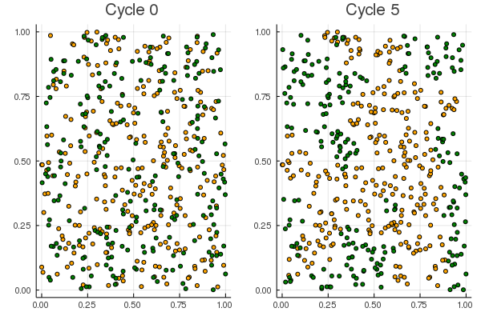

# Schelling's segregation model

*This code is inspired by [this lecture](https://julia.quantecon.org/multi_agent_models/schelling.html)*

In 1969 Thomas C. Schelling devised a simple model to study racial segregation.
The model shows the striking effect of slight individual preferences leading to significant societal changes.

We consider two types of people living on the unit square.
A person is said to be happy if half or more of some fixed number `neighborhood::Int` of nearest neighbors are of the same *type*.
The notion of *near* refers to the Euclidean distance.
Hence, a person prefers to have a slightly higher number of alike persons; but the person is definitely not averse to living in mixed neighborhoods.

Schelling's model goes as follows:
- Scatter a fixed amount of agents across the unit square.
- For each agent do the following (which we will call a *cycle*)
  1. Draw a random location on the unit square.
  2. If the person is happy at the new location, then let the person move there.
  3. If the person is not happy, then go back to step 1.
- If at least one person moved, then we go through another cycle. If no person wants to move anymore, then we are done.

# Example
Clone the code to your machine.
Then, by calling
```julia
include("schelling-segregation-model.jl")
run_model(500; neighborhood=10)
```
we run Schelling's segregation model for a total population of `500` that are randomly scattered to the unit square, and that are randomly assigned a type.
The `neighborhood = 10` specifies the number of the neighbors a person considers for her happiness.

The output is something like this:



The left figure is a scatter plot of the initial distribution of persons.
The right figure shows the *converged* (aka perfectly happy) population after 5 cycles.
As we can see, there have emerged certain areas of just one type of persons.
The number of *mixed* neighborhoods is surprisingly small.
